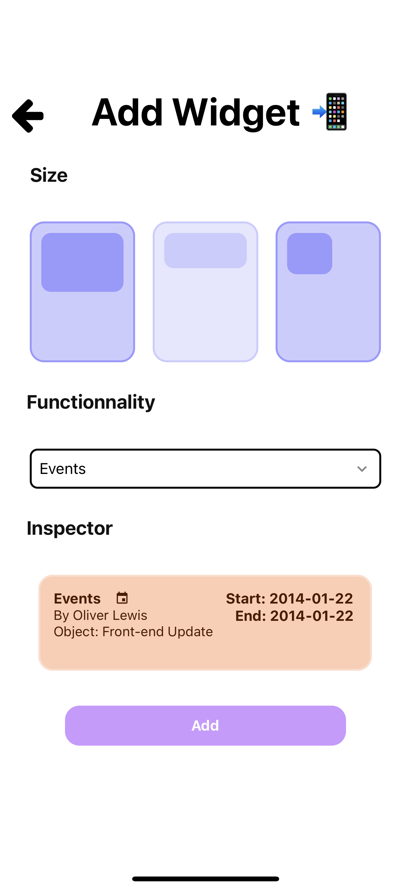

# The Project: Survivor
```
3rd year Epitech Project.
Quick topic: We are excited to introduce a new project in collaboration with a very talented businessman,
Jean-Eudes Berlier, with a strong commitment to excellence and a track record of success.
Mr Berlier chose our school to develop his brand new concept, and this is quite an opportunity for you all!
The project represents a dynamic and innovative undertaking that aims to revolutionise communication and team eciency in business units.
The idea seems pretty simple at first sight, but must be highly qualitative to be complete and improve later on.
To make it simple, you must built a React-native portal mobile app with a employees photo gallery and customizable widgets.
This app is intended to be used as a white label by employees, so it must include authentication and design customization.
You will get very quickly more details about it, but considering the short delay, feel free to start as soon as possible.
```

# Usage
```
npx expo start
```

# Overview
<div align="center">
  
  
  
</div>
